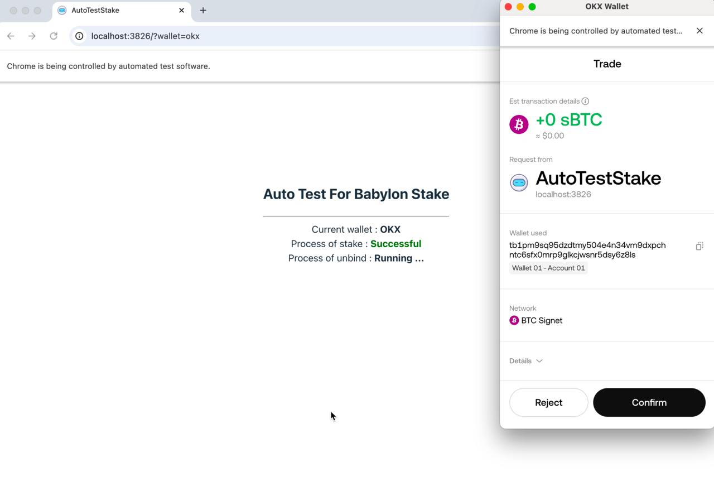

# Babylon-staking-autotest

## Some settings before starting up

1. Modify the file : [server => user.js](/server/constants/user.cjs) , enter your own mnemonic words and password

    ```
    const mnemonicsWords = 'your mnemonics phrase'
    const password = 'your password'
    ```

2. Modify the file : [src => user.js](/src/constants//user.ts) , Enter your: address + public key + staking delegation data
    > Since the test only involves wallet signature verification, the staking transaction does not actually get on-chain. However, to test the unbonding function, you need a staking delegation data. Therefore, it is best to make a real staking transaction and then put the delegation data after staking into this file
    
    > Additionally, the Tomo wallet's address is different from the other three wallets, so you need to generate a separate staking delegation data specifically for the Tomo wallet

    ```js
    // okx、bitget、onekey
    const dataCommon: IUserData = { your data ... }
    // tomo
    const dataTomo: IUserData = { your data ... }
    ```

3. Modify environment variables, file : [env.cjs](/server/scripts/env.cjs) , for the tgInfo field, you need to set it to your own TG Bot Token and channel ID. Modify the other fields according to your needs

  - `pageUrl` : The link where the front-end page is located
  - `logFolder` : The folder for log output
  - `filenamePrefix` : log file name (timestamp will be automatically appended)
  - `fileHeaderTextFlag` : log title
  - `crxsDownloadDir` : The download folder for .crx file extensions
  - `tgInfo` : Your TG channel information

## Startup instructions

- Launch the front-end :

  ```sh
  # first
  npm install
  # then
  npm run dev
  ```

- Start automated testing :

  ```sh
  # Tests will be executed in sequence: okx => tomo => bitget => onekey
  # After execution, wait for a certain period, then repeat the tests. The current time interval is 2.5 days
  npm start

  # Tests will be executed in sequence, but only once. After completion, the process will end
  npm run test:all

  # Specify a particular wallet for testing, and execute only once
  npm run test:okx
  npm run test:tomo
  npm run test:bitget
  npm run test:onekey
  ```

- The execution process is fully automated, requiring no manual operation. Just wait for the node process to finish. The execution screen is as follows :

  

- After completion, the logs will be output to the `/logs` folder by default. Additionally, the test results will be sent to your TG channel, as shown below :

  ```text
  AUTO-TEST-STAKE 10/13/2024 7:13:07 AM

  Provider version: 1.0.11

  OKX:
  version: 3.23.22
  process-of-stake: succeeded
  process-of-unbonding: succeeded

  TOMO:
  version: 1.6.6
  process-of-stake: succeeded
  process-of-unbonding: succeeded

  BITGET:
  version: 2.15.0
  process-of-stake: succeeded
  process-of-unbonding: succeeded

  ONEKEY:
  version: 5.2.4
  process-of-stake: succeeded
  process-of-unbonding: succeeded
  ```

## Other notes

- BTC Network : Signet

- Automated testing tool : Selenium

- For each wallet's extension file, the latest version will be automatically checked every time the tool is executed. If a newer version exists, the latest one will be downloaded

- Supports receiving requests, and upon receiving a specific request, it will immediately execute a full wallet test

- The bitget wallet can sometimes be unstable and unable to enter the signature page, which is a normal occurrence and is an issue with the bitget wallet itself

- In the `/server/crxs/` folder, there are default extension files. If the download is not successful during execution, these default files will be used

- You can deploy this project to your own server, and then use `npm run dev` + `npm start` to automatically execute tests at regular intervals
